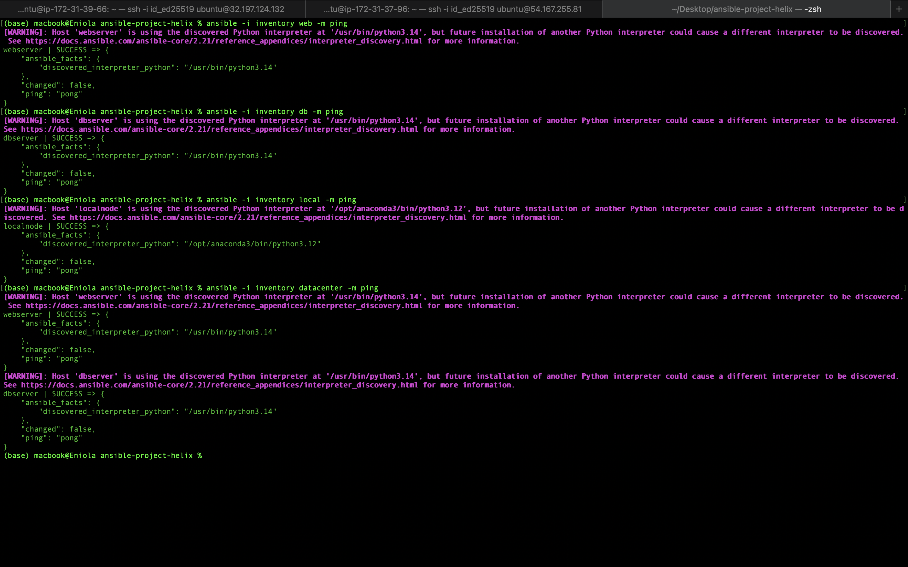
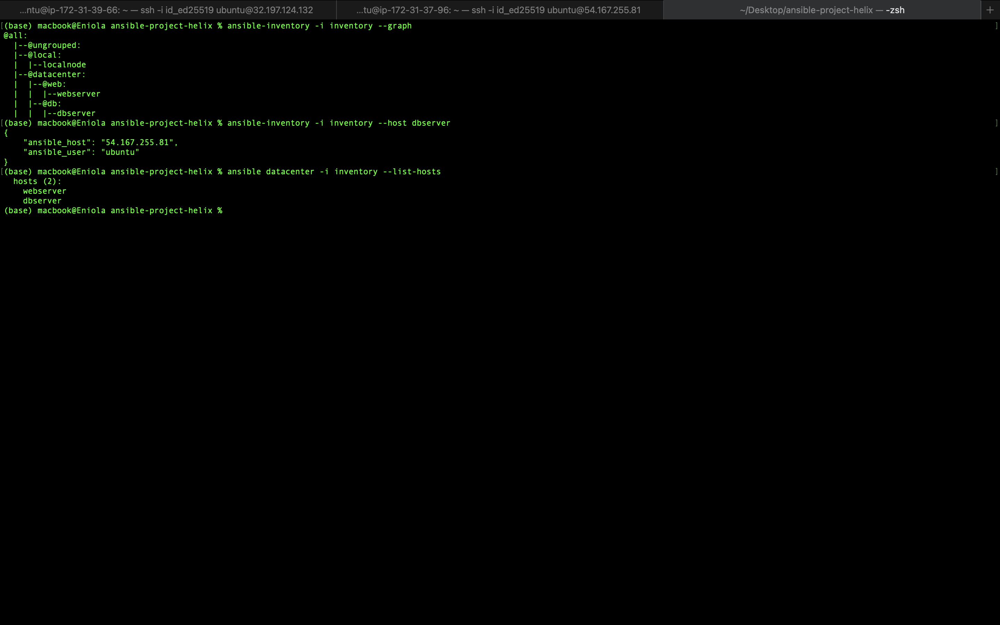

# Part A – Ansible Inventory Setup

## Overview

The first step in using Ansible is creating an **inventory**, which is a file that defines the hosts Ansible can manage. The inventory tells Ansible **which machines to connect to**, **how to connect to them**, and **how those machines are logically grouped**.

In this lab, a single inventory file was created using the **INI inventory format**.

---

## Prerequisites

Before creating the inventory:

- Generated an SSH key pair using `ssh-keygen`.
- Launched two Ubuntu EC2 instances on AWS.
- Added the generated public key to the `~/.ssh/authorized_keys` file on both instances.
- Verified passwordless SSH access to both servers using the generated private key.

This allows Ansible to authenticate over SSH without requiring passwords.

---

## Inventory Structure

The inventory consists of four groups:

- **web** – Contains the web server.
- **db** – Contains the database server.
- **local** – Represents the control node (local machine).
- **datacenter** – A parent group containing both the `web` and `db` groups.

```text
                datacenter
               /          \
              /            \
           web             db
            |               |
      webserver        dbserver

local
 |
localnode
```

---

## Inventory File

```ini
[web]
webserver ansible_host=<WEB_SERVER_PUBLIC_IP> ansible_user=ubuntu

[db]
dbserver ansible_host=<DB_SERVER_PUBLIC_IP> ansible_user=ubuntu

[local]
localnode ansible_connection=local

[datacenter:children]
web
db
```

> Replace `<WEB_SERVER_PUBLIC_IP>` and `<DB_SERVER_PUBLIC_IP>` with your EC2 public IP addresses.

---

## Inventory Components

### Host Alias

Instead of referencing servers by their IP addresses directly, each server is assigned a friendly hostname.

Example:

```ini
webserver ansible_host=<WEB_SERVER_PUBLIC_IP>
```

Here:

- `webserver` is the host alias.
- `ansible_host` specifies the actual IP address.
- `ansible_user` specifies the SSH user used during connection.

Using host aliases makes inventories easier to read and maintain.

---

### Groups

Groups allow multiple hosts to be managed together.

Example:

```ini
[web]
webserver ...
```

Running a command against the `web` group targets every host within that group.

---

### Parent Groups

The `datacenter` group is a **parent group** that contains other groups instead of individual hosts.

```ini
[datacenter:children]
web
db
```

Executing a command against `datacenter` automatically targets every host contained within both the `web` and `db` groups.

---

### Local Connection

The local machine is represented as:

```ini
[local]
localnode ansible_connection=local
```

Unlike remote hosts, this connection does **not** use SSH. Commands targeting this group execute directly on the Ansible control node.

---

## Verifying the Inventory

The inventory was verified using the Ansible `ping` module.

### Ping all managed hosts

```bash
ansible -i inventory all -m ping
```

### Ping only the web server

```bash
ansible -i inventory web -m ping
```

### Ping only the database server

```bash
ansible -i inventory db -m ping
```

### Ping the local control node

```bash
ansible -i inventory local -m ping
```

### Ping every server in the datacenter group

```bash
ansible -i inventory datacenter -m ping
```

Successful responses returned:

```text
SUCCESS => {
    "changed": false,
    "ping": "pong"
}
```

This confirms that:

- SSH connectivity is working.
- Authentication is successful.
- Python is available on the managed hosts.
- Ansible can execute modules on each target host.

## Connectivity Evidence

The screenshot below shows the successful execution of all four connectivity (ping)n commands.



---

## Inventory Verification Commands

After creating the inventory, the following Ansible inventory commands were executed to validate the inventory structure and host configuration.

### Display the Inventory Hierarchy

```bash
ansible-inventory -i inventory --graph
```

Displays the inventory as a hierarchical tree, showing the relationship between parent groups, child groups, and hosts.

---

### Display Host Variables

```bash
ansible-inventory -i inventory --host dbserver
```

Displays all variables associated with the `dbserver` host as interpreted by Ansible.

---

### List Hosts in the Parent Group

```bash
ansible datacenter -i inventory --list-hosts
```

Lists every host contained within the `datacenter` parent group without executing any tasks.

---

## Verification Evidence

The screenshot below shows the successful execution of all three inventory verification commands.



----

## Key Concepts Learned

- What an Ansible inventory is.
- Difference between hosts and groups.
- Using host aliases instead of raw IP addresses.
- Creating parent groups with `:children`.
- Managing the local control node with `ansible_connection=local`.
- Verifying connectivity using the `ping` module.
- Organising infrastructure logically for easier management.
